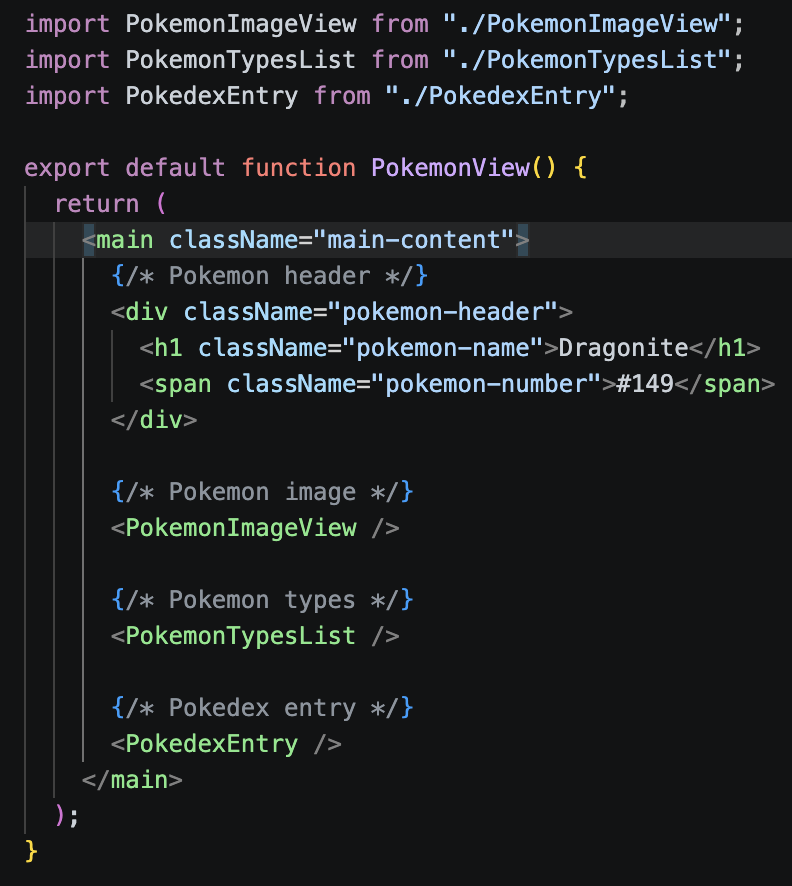

# Each branch is a separate practice exercise with its own commits;
### cooool;


## 拆分组件App.tsx
 App.tsx（变得简洁）                                               
  ├── SearchBar.tsx                                                   
  ├── PokemonList.tsx                                                 
  │   └── PokemonListItem.tsx                                         
  └── PokemonView.tsx                                       
      
      ├── PokemonImageView.tsx                                        
      ├── PokemonTypesList.tsx            
      │   └── TypeBadge.tsx                                           
      └── PokedexEntry.tsx    


## step-03                                      
用真实数据（假数据）替换写死的内容，通过 props 传递给组件。
所有组件开始接收 props，不再写死内容                              
  - 用 .map() 遍历数组，生成列表         


## 06
  把假数据换成真实 API
  ┌────────────────────────────────┬───────────────────────────┐      
  │              改动              │           说明            │
  ├────────────────────────────────┼───────────────────────────┤      
  │ 删掉 dummyData                 │ 不再用假数据              │
  ├────────────────────────────────┼───────────────────────────┤      
  │ 加 useEffect + fetch           │ 从真实 API 获取宝可梦数据 │
  ├────────────────────────────────┼───────────────────────────┤
  │ PokemonView 改成接收 dexNumber │ 自己去 API 拿详情         │
  └────────────────────────────────┴───────────────────────────┘      
                                                                      
  API 地址：https://pkserve.ocean.anhydrous.dev/api/pokedex   

```
async function fetchPokemonByGen(gen) {                   
    const url =                                                       
  `https://pkserve.ocean.anhydrous.dev/api/pokedex?gen=${gen}`;       
    const response = await fetch(url);  // ← 发请求，等待回应         
    const data = await response.json(); // ← 把回应转成 JS 对象       
    setPokemon(data);                   // ← 存进 state               
  }   

重新渲染是因为：setState                                        
                                                            
  setPokemon(data);  ← 这句触发重新渲染                               
                                                            
  React 的规则是：只要 state 变了，组件就自动重新渲染。  


 useEffect(() => {                                                   
    fetchPokemonByGen(searchOptions.gen);     
  }, [searchOptions.gen]);                                            
                                                            
  意思是：当 gen 变了，就去 API 拿新数据。
```    


## 07 只改一个文件PokemonImageView
图片加载占位符

## 08 backend
- 搭好 Express 框架                        
- 把宝可梦数据放进 species.json                                    
- routes/ 和 db/ 都是空的，留给后面的 step    

----


😵‍💫
### ？？

###  ？？在根目录 npm install 
 Monorepo + Workspaces  ： "workspaces": ["frontend", "backend"]   
 npm 看到这个，在根目录运行 npm install                              
  时会自动进入每个子文件夹，把前端和后端的依赖都装好。      
                                                                      
  npm install（根目录）                                               
    ↓ 自动进入         
    frontend/ → 装 React、Vite 等                                     
    backend/  → 装 Express、nodemon 等                      
                                          
  一条命令搞定所有依赖，不用分别进去装。  

### ？？package.json / .env /.yml 的区别
三个文件完全独立，各自服务于不同的工具：                            
  - npm 读 package.json ( 项目信息、依赖列表、启动命令) 
  - Node.js 读 .env （秘密变量（密码、端口、API密钥）
  - Docker 读 docker-compose.yml  （Docker 容器配置（启动哪些服务））[text](../../lab/mern-pokedex/backend/src/db/schema.js)