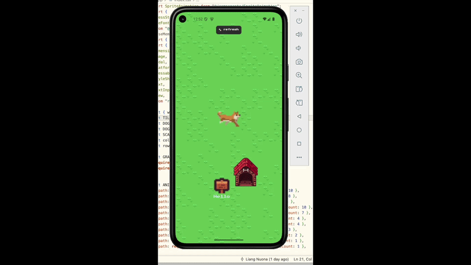
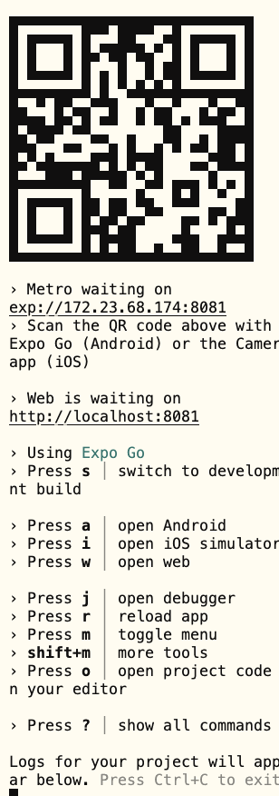

# Tech Tutorial: React Native                                                                                   
  This tutorial introduces **React Native** — a framework for building real     
  native mobile apps using JavaScript and React. Instead of starting from      
  scratch, this tutorial focuses on what's **the same** and what's **different**
   compared to the web React you already know.
                                                                               
  The demo consists of two side-by-side projects:

  | Folder | Stack | Purpose |                                                  
  |--------|-------|---------|
  | `dog_web/` | React + Vite (TypeScript) | Web version — the baseline you     
  already know |                                                                
  | `dog_app/` | React Native + Expo (TypeScript) | Native version — the       
  tutorial focus |                                                              
                  
  Both apps implement the same dog scene, so you can compare them line by line. 
         
## Demo         
  


  ---                                                                           
                  
  ## Prerequisites                                                             

  ### For dog_web
  - [Node.js](https://nodejs.org/) (v18 or above)
                                                                                
  ### For dog_app (React Native)
  - [Node.js](https://nodejs.org/) (v18 or above)                               
  - [Android Studio](https://developer.android.com/studio) — for the Android    
  emulator                                                                     
    - After installing, open Android Studio → Virtual Device Manager → create a  device → start it                                                             
  - Or: install **Expo Go** on a real Android/iOS phone         
    - [Expo Go](https://expo.dev/go) 
       
                                                                                
  ---             
                                                                                
  ## Getting Started
                                                                               
  ### Run the web version
 ```bash                                                                       
  cd dog_web                                                                    
  npm install                                                                   
  npm run dev                                                                   
  ```    
  Then open  http://localhost:xxxx  in your browser.                              
                  
  ---                   


  Run the React Native version
 ```bash    
  cd dog_app
  npm install                                                                   
  npx expo start
```

  In the terminal, press:
  - Scan the QR code with Expo Go on a real phone                              
  - a — open on Android emulator (must have Android Studio set up)             
  - w - open  http://localhost:xxxx  in your browser.  
   
    
   
  ---           


  ## What the App Does
                                                                                
  ### The dog app is a small interactive scene:
                                                                                
  - An animated dog sprite (Akita) plays different animations randomly          
  - Tap the 🦴 refresh button to reposition the dog and change its animation    
  - Tap the dog house to toggle a color change                                  
  - Tap the sign board to open a message input — leave a note that appears on   
  the sign                                                                      
  - Tap the dog to trigger the run animation and a dialog bubble                 
                                                                                
  ---                                                                          
  ### Key Concepts Covered
                      
## What's the **same** in React and React Native                                    
```
  ┌──────────────────────────────┬──────────────────────────────────────────┐
  │           Feature            │                  Notes                   │   
  ├──────────────────────────────┼──────────────────────────────────────────┤
  │ import / export              │ Identical ES module syntax               │  
  ├──────────────────────────────┼──────────────────────────────────────────┤
  │ JSX syntax                   │ Components look the same                 │   
  ├──────────────────────────────┼──────────────────────────────────────────┤
  │ useState / useEffect /       │ Same hooks, same API                     │   
  │ useMemo                      │                                          │   
  ├──────────────────────────────┼──────────────────────────────────────────┤  
  │ Props & Components           │ Same pattern                             │   
  ├──────────────────────────────┼──────────────────────────────────────────┤
  │ TypeScript                   │ { name: string } works the same          │   
  ├──────────────────────────────┼──────────────────────────────────────────┤
  │ All JS logic                 │ Loops, conditions, functions — no        │   
  │                              │ difference                               │
  └──────────────────────────────┴──────────────────────────────────────────┘   
```             

## What's **different**
```
  ┌─────────────────────────┬─────────────────────────────────┐
  │        Web React        │          React Native           │
  ├─────────────────────────┼─────────────────────────────────┤
  │ <div>                   │ <View>                          │
  ├─────────────────────────┼─────────────────────────────────┤
  │ <p>, <span>             │ <Text>                          │                 
  ├─────────────────────────┼─────────────────────────────────┤
  │          │ <Image source={require('...')}> │                 
  ├─────────────────────────┼─────────────────────────────────┤                 
  │ <input>                 │ <TextInput>                     │                
  ├─────────────────────────┼─────────────────────────────────┤                 
  │ <button> + onClick      │ <Pressable> + onPress           │
  ├─────────────────────────┼─────────────────────────────────┤                 
  │ {show && <div>}         │ <Modal visible={show}>          │
  ├─────────────────────────┼─────────────────────────────────┤                 
  │ fontSize: '16px'        │ fontSize: 16 (no px)            │
  ├─────────────────────────┼─────────────────────────────────┤                 
  │ @import url(...) in CSS │ useFonts() async hook           │
  ├─────────────────────────┼─────────────────────────────────┤                 
  │ External .css file      │ StyleSheet.create()             │
  └─────────────────────────┴─────────────────────────────────┘                 
```           


  ---                                                                          
## Project Structure
```
  dog_app/
  ├── app/                                                                      
  │   ├── _layout.tsx       # App shell / navigation wrapper
  │   └── index.tsx         # Main screen (home page)                           
  ├── components/ 
  │   └── SpriteAnimation.tsx  # Handles sprite sheet animation                 
  └── assets/               # Images: dog sprites, grass tiles, house, sign     
                                                                                
  dog_web/                                                                      
  ├── src/                                                                      
  │   ├── App.tsx           # Main component                                   
  │   ├── SpriteAnimation.tsx                                                  
  │   └── index.css                                                             
  └── public/
```                

  ---             
 
 ## Code Comparison: Web React vs React Native   

  ### 1. Container element                                                      
                  
  **Web React**                                                                
  ```tsx
  <div style={{ width: '100vw', height: '100vh' }}>
    ...                                                                         
  </div>
  ```                                                                           
                  
  **React Native**                                                             
  ```tsx
  <View style={{ flex: 1 }}>
    ...
  </View>                                                                       
  ```
  > `div` becomes `View`. Note: no `px` — React Native uses unitless numbers.   
                                                                                
  ---                                                                          
                                                                                
  ### 2. Image                                                                  
                                                                               
  **Web React**                                                                 
  ```tsx          
   
  ```                                                                           
  
  **React Native**                                                              
  ```tsx          
  <Image                                                                       
    source={require('@/assets/dog/Akita-Idle.png')}
    style={{ width: 100, height: 100 }}                                         
  />
  ```                                                                           
  > Two differences: attribute name changes from `src` to `source`, and you use
  `require()` instead of a string path. This is because React Native needs to   
  bundle the file at compile time.
                                                                                
  ---             
                                                                               
  ### 3. Click / Press

  **Web React**
  ```tsx
  <button onClick={handleRefresh}>
    🦴 refresh                                                                  
  </button>
                                                                                
  <div onClick={() => setShowInput(true)}>                                      
    ...                                                                        
  </div>                                                                        
  ```             
                                                                               
  **React Native**
  ```tsx
  <Pressable
    onPress={handleRefresh}
    style={({ pressed }) => [styles.refreshBtn, pressed && { opacity: 0.5 }]}
  >                                                                             
    <Text>🦴 refresh</Text>
  </Pressable>                                                                  
                  
  <Pressable onPress={() => setShowInput(true)}>                                
    ...           
  </Pressable>                                                                 
  ```
  > On web, any element can take `onClick`. In React Native, you must wrap with
  `Pressable` — and it gives you a `pressed` state for visual feedback.         
   
  ---                                                                           
                  
  ### 4. Modal / Overlay                                                       

  **Web React**
  ```tsx
  {showInput && (
    <div onClick={() => setShowInput(false)} style={{
      position: 'fixed', inset: 0,                                              
      backgroundColor: 'rgba(0,0,0,0.5)',
      display: 'flex', alignItems: 'center', justifyContent: 'center',          
      zIndex: 100,                                                              
    }}>                                                                        
      ...                                                                       
    </div>        
  )}                                                                           
  ```

  **React Native**                                                              
  ```tsx
  <Modal visible={showInput} transparent animationType="fade">                  
    <Pressable style={styles.modalOverlay} onPress={() => setShowInput(false)}>
      ...                                                                      
    </Pressable>                                                                
  </Modal>
  ```                                                                           
  > On web, you manually build an overlay with `position: fixed`. React Native
  has a built-in `<Modal>` component — one tag handles it all.                  
   
  ---                                                                           
                  
  ### 5. Text Input                                                            

  **Web React**
  ```tsx
  <input
    value={inputText}
    onChange={(e) => setInputText(e.target.value)}
    placeholder="type here..."
  />                                                                            
  ```
                                                                                
  **React Native**
  ```tsx                                                                       
  <TextInput
    value={inputText}
    onChangeText={setInputText}
    placeholder="leave a message for Hammer..."
  />                                                                            
  ```
  > `onChange` becomes `onChangeText` — and it passes the string directly, no   
  `e.target.value` needed.                                                      
                                                                               
  ---                                                                           
                  
  ### 6. Fonts                                                                  
   
  **Web React**                                                                 
  ```css          
  /* index.css */                                                              
  @import
  url('https://fonts.googleapis.com/css2?family=Press+Start+2P&display=swap');  
  ```
                                                                                
  **React Native**
  ```tsx                                                                       
  // install: @expo-google-fonts/press-start-2p
  import { PressStart2P_400Regular, useFonts } from                             
  '@expo-google-fonts/press-start-2p';
                                                                                
  const [fontsLoaded] = useFonts({ PressStart2P_400Regular });                  
                                                                               
  const pixelFont = fontsLoaded ? { fontFamily: 'PressStart2P_400Regular' } :   
  {};             
  ```                                                                           
  > On web, one CSS import line is enough. In React Native, fonts load
  **asynchronously** — you use the `useFonts()` hook and wait for it to finish  
  before applying the font family.